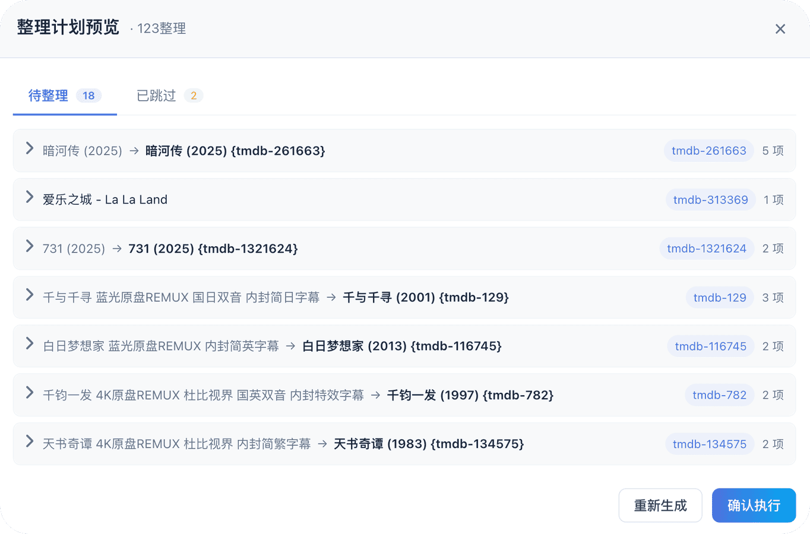

<a name="readme-top"></a>
<br>
### 本项目上游是： 开源 LitePan项目，链接地址：https://github.com/Ponphil/LitePan

---

## ▎ 一条龙：从资源到播放

**MyPan 不是网盘管理器，是一条完整的影片流水线。** 资源从哪儿来、怎么落到网盘、
怎么变得整整齐齐、怎么被播放器认出来 —— 全流程打通，中间不需要你手动搬一次文件。

```
 ① 发现资源          ② 落到网盘            ③ 目录整理              ④ STRM           ⑤ 刮削           ⑥ 播放
┌───────────┐    ┌──────────────┐    ┌──────────────────┐    ┌────────────┐   ┌───────────┐   ┌──────────┐
│ 磁力 / ed2k│    │ 网盘原生离线  │    │ 删广告小文件      │    │ 生成 .strm │   │ 写 nfo    │   │ Emby     │
│ 分享链     │ →  │ 或内置下载器  │ →  │ 批量改名          │ →  │ 指向本机   │ → │ 存海报    │ → │ Jellyfin │
│ 直链 / 种子 │    │ 转存别人的分享│    │ 移进作品文件夹    │    │ 播放网关   │   │ 海报墙    │   │ 飞牛 …   │
└───────────┘    └──────────────┘    └──────────────────┘    └────────────┘   └───────────┘   └──────────┘
   TG 订阅 /          离线下载 /          目录整理 /             STRM 任务         刮削            302 直链
   番号订阅            分享转存            番号自动归档                          自动联动        或本机代理
```

更具体地说，每一步都在做这些事：

| 环节 | 干什么 | 关键能力 |
|---|---|---|
| **① 发现** | 从 TG 频道、网盘搜索、番号站点把资源找出来 | TG 影片订阅 · 番号（JAV）订阅 · 盘搜 |
| **② 落盘** | 把链接交给网盘自己去下，或让 MyPan 自己下 | 网盘原生离线 · 内置 BT 下载器 · **分享链转存** |
| **③ 整理** | 把乱七八糟的目录变成规规矩矩的作品文件夹 | **删广告小文件** · **批量改名** · **移进目标文件夹** · 先预览后应用 |
| **④ STRM** | 给每个视频生成一个 `.strm` 文本文件，播放器当它是本地片 | STRM 任务 · 播放网关 · 302 直链 / 本机代理 |
| **⑤ 刮削** | 写 nfo、下海报，让海报墙认得这部片 | TMDB 匹配 · 元数据写入 · 可追更 |
| **⑥ 播放** | 播放器直连网盘播放，不占服务器带宽 | Emby / Jellyfin / 飞牛代理 · WebDAV · FUSE |

**其中「整理」那一步是真正省事的地方**：不用你一个个文件夹去翻。
程序会把广告 `.url` / `.txt` / `.jpg` 这类小垃圾挑出来、把文件名规整成番号、
把散在根目录的片子移进它该在的作品目录里 —— 而且**先给你看一遍计划，你点确认才动**。

> 整条流水线可以用「自动联动」串起来：离线下载一完成，自动触发整理 → STRM → 刮削 → 刷库。
> 你只管订阅，剩下的它自己跑。

## ▎ 功能简述

<table>
  <tr>
    <td width="50%" valign="top" align="center">
      <h3>多网盘聚合</h3>
      <p align="left">11 种网盘 / 存储，多账号统一管理，一个界面看完。</p>
      
    </td>
    <td width="50%" valign="top" align="center">
      <h3>跨盘秒传</h3>
      <p align="left">能秒传就秒传，否则自动上传。</p>
      
    </td>
  </tr>
  <tr>
    <td width="50%" valign="top" align="center">
      <h3>STRM 直连播放</h3>
      <p align="left">生成 <code>.strm</code>，对接 Emby / Jellyfin。</p>
      
    </td>
    <td width="50%" valign="top" align="center">
      <h3>STRM 刮削</h3>
      <p align="left">写 nfo / 海报，海报墙可追更。</p>
      
    </td>
  </tr>
  <tr>
    <td width="50%" valign="top" align="center">
      <h3>目录整理</h3>
      <p align="left">删广告小文件、批量改名、归档到位，预览后再应用。</p>
      
    </td>
    <td width="50%" valign="top" align="center">
      <h3>自动联动</h3>
      <p align="left">整理、STRM、刮削、刷库串起来。</p>
      
    </td>
  </tr>
</table>

## ▎ 订阅：让资源自己找上门

- **TG 影片订阅** —— 订阅电影 / 剧集，程序去 Telegram 频道里搜资源并自动推送
  （磁力 / ed2k / 115 分享链 / 直链都能认）
- **番号（JAV）订阅** —— 按影片、演员、清单订阅，自动抓 JAVDB / JAVBUS 的磁链并推送；
  评论区里用户分享的链接也能一并纳入候选
- **推送通道自动判定** —— 按链接协议与目标网盘的实际能力挑「网盘原生离线」还是「内置下载器」，
  推不动的会告诉你为什么

## ▎ 挂载与更多功能

支持 WebDAV 与 FUSE 本地挂载，另有 302 直链、缓存保持、命名对齐、离线下载、
通知中心、封面抽帧等能力。

📖 **[各网盘能力对照表 → CAPABILITIES.md](./CAPABILITIES.md)** — 哪个网盘支持磁力 / ed2k / 秒传 / 分享转存 / 302，一张表看全。

📖 **[完整使用说明 → docs/GUIDE.md](./docs/GUIDE.md)** — 每个功能的详细用法、部署步骤、已知限制与常见问题。

---

## ▎ 快速开始

**Docker Compose 部署** · 镜像标签：`latest` 或指定 `v2.0.0`

```yaml
services:
  litepan:
    image: desstg/mypan:latest
    container_name: mypan
    restart: unless-stopped
    ports:
      - "5211:5211"
      # 内置 Magnet 的 TCP/uTP/DHT 监听端口；若在后台修改，需同步调整映射
      - "42069:42069/tcp"
      - "42069:42069/udp"
    environment:
      - TZ=Asia/Shanghai
    volumes:
      - ./data:/app/data
      - ./strm:/app/strm
      - ./mounts:/app/mounts:shared

      # 可选：将 FUSE 读缓存单独映射，建议放到更快的磁盘
      # - ./fuse_read_cache:/app/data/fuse_read_cache
    devices:
      - /dev/fuse:/dev/fuse
    pid: "host"
    privileged: true
    # 没有代理环境的，可以在下方配置tmdb的hosts
    # extra_hosts:
      # - "api.themoviedb.org:这里填写对应的ip"
      # - "image.tmdb.org:这里填写对应的ip"
    # 注意：也可以在程序内「目录整理 → TMDB 设置」填写反代主域名（自动补 /3 与 /t/p），与 hosts 二选一即可
```

打开 `http://你的IP:5211`，默认管理员密码均为admin。  
需要 FUSE 时请确保宿主机具备 `/dev/fuse` 权限。
